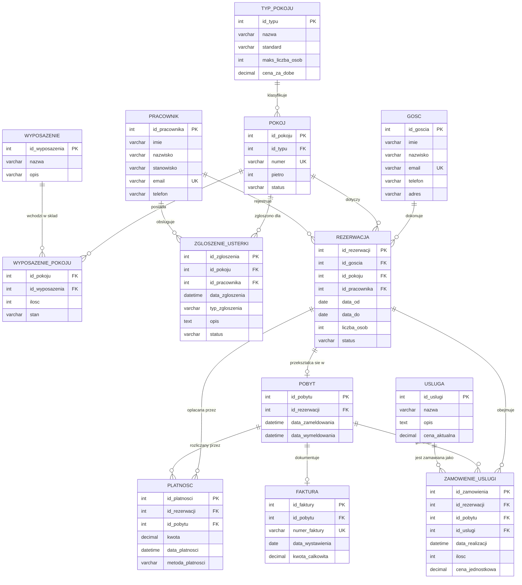

# sqlprojekt
## Diagram Encji i Związków (ERD) - System Obsługi Hotelu

```mermaid
erDiagram
    GOSC {
        int id_goscia PK
        varchar imie
        varchar nazwisko
        varchar email UK
        varchar telefon
        varchar adres
    }

    TYP_POKOJU {
        int id_typu PK
        varchar nazwa
        varchar standard
        int maks_liczba_osob
        decimal cena_za_dobe
    }

    POKOJ {
        int id_pokoju PK
        int id_typu FK
        varchar numer UK
        int pietro
        varchar status
    }

    WYPOSAZENIE {
        int id_wyposazenia PK
        varchar nazwa
        varchar opis
    }

    WYPOSAZENIE_POKOJU {
        int id_pokoju FK
        int id_wyposazenia FK
        int ilosc
        varchar stan
    }

    PRACOWNIK {
        int id_pracownika PK
        varchar imie
        varchar nazwisko
        varchar stanowisko
        varchar email UK
        varchar telefon
    }

    ZGLOSZENIE_USTERKI {
        int id_zgloszenia PK
        int id_pokoju FK
        int id_pracownika FK
        datetime data_zgloszenia
        varchar typ_zgloszenia
        text opis
        varchar status
    }

    REZERWACJA {
        int id_rezerwacji PK
        int id_goscia FK
        int id_pokoju FK
        int id_pracownika FK
        date data_od
        date data_do
        int liczba_osob
        varchar status
    }

    POBYT {
        int id_pobytu PK
        int id_rezerwacji FK
        datetime data_zameldowania
        datetime data_wymeldowania
    }

    USLUGA {
        int id_uslugi PK
        varchar nazwa
        text opis
        decimal cena_aktualna
    }

    ZAMOWIENIE_USLUGI {
        int id_zamowienia PK
        int id_rezerwacji FK
        int id_pobytu FK
        int id_uslugi FK
        datetime data_realizacji
        int ilosc
        decimal cena_jednostkowa
    }

    PLATNOSC {
        int id_platnosci PK
        int id_rezerwacji FK
        int id_pobytu FK
        decimal kwota
        datetime data_platnosci
        varchar metoda_platnosci
    }

    FAKTURA {
        int id_faktury PK
        int id_pobytu FK
        varchar numer_faktury UK
        date data_wystawienia
        decimal kwota_calkowita
    }

    GOSC ||--o{ REZERWACJA : "dokonuje"
    TYP_POKOJU ||--o{ POKOJ : "klasyfikuje"
    POKOJ ||--o{ REZERWACJA : "dotyczy"
    POKOJ ||--o{ WYPOSAZENIE_POKOJU : "posiada"
    WYPOSAZENIE ||--o{ WYPOSAZENIE_POKOJU : "wchodzi w sklad"
    POKOJ ||--o{ ZGLOSZENIE_USTERKI : "zgloszono dla"
    PRACOWNIK ||--o{ ZGLOSZENIE_USTERKI : "obsluguje"
    PRACOWNIK ||--o{ REZERWACJA : "rejestruje"
    REZERWACJA ||--o| POBYT : "przeksztalca sie w"
    REZERWACJA ||--o{ PLATNOSC : "oplacana przez"
    POBYT ||--o{ PLATNOSC : "rozliczany przez"
    REZERWACJA ||--o{ ZAMOWIENIE_USLUGI : "obejmuje"
    POBYT ||--o{ ZAMOWIENIE_USLUGI : "generuje"
    USLUGA ||--o{ ZAMOWIENIE_USLUGI : "jest zamawiana jako"
    POBYT ||--o| FAKTURA : "dokumentuje"
```
